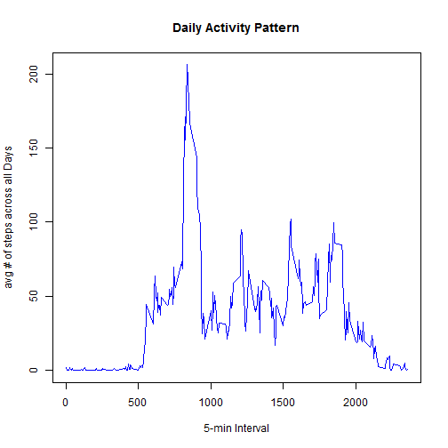

Loading and preprocessing the data
==================================


```r
data = read.csv('activity.csv', 
                colClasses = c('numeric','character','numeric')  )
```


What is mean total number of steps taken per day?
========================================================

1. Make a histogram of the total number of steps taken each day


```r
totalSteps = aggregate(steps~date, data=data, sum)
hist(totalSteps$steps, main='Total Steps Per Day',
     xlab='Total # of steps',
     ylab='Frequency (# of days)' )
```

 

2. Calculate and report the **mean** and **median** total number of steps taken per day


```r
mean(totalSteps$steps)
```

```
## [1] 10766.19
```

```r
median(totalSteps$steps)
```

```
## [1] 10765
```

What is the average daily activity pattern?
=============================================

1. Make a time series plot (i.e. type = "l") of the 5-minute interval (x-axis) and the average number of steps taken, averaged across all days (y-axis)


```r
ts <- tapply(data$steps, data$interval, mean, na.rm=TRUE)
plot(row.names(ts), ts, type='l', col='blue' , main='Daily Activity Pattern' ,ylab='avg # of steps across all Days', xlab='5-min Interval')
```

 

2. Which 5-minute interval, on average across all the days in the dataset, contains the maximum number of steps?


```r
steps_pattern <- aggregate(data$steps ~ data$interval, data, FUN=mean, na.rm=T)
names(steps_pattern) <- c("interval","average_steps")

max_steps <- which.max(steps_pattern$average_steps)
max_steps
```

```
## [1] 104
```

Imputing missing values
========================

1.Calculate and report the total number of missing values in the dataset (i.e. the total number of rows with `NA`s)


```r
sum(is.na(data$steps))
```

```
## [1] 2304
```

2.Devise a strategy for filling in all of the missing values in the dataset. The strategy does not need to be sophisticated. For example, you could use the mean/median for that day, or the mean for that 5- minute interval, etc.

**Strategy:**  I have used the mean steps for that 5- minute interval and imputed all NAs with that as shown below.


```r
na_data <- data[is.na(data),]
na_data$steps <- merge(steps_pattern, na_data)$average_steps
```

3.Create a new dataset that is equal to the original dataset but with the missing data filled in.


```r
data2 <- data
data2[is.na(data), ] <- na_data

head(data2)
```

```
##      steps       date interval
## 1 1.716981 2012-10-01        0
## 2 1.716981 2012-10-01        5
## 3 1.716981 2012-10-01       10
## 4 1.716981 2012-10-01       15
## 5 1.716981 2012-10-01       20
## 6 1.716981 2012-10-01       25
```

4.Make a histogram of the total number of steps taken each day and Calculate and report the **mean** and **median** total number of steps taken per day. Do these values differ from the estimates from the first part of the assignment? What is the impact of imputing missing data on the estimates of the total daily number of steps?


```r
data2_daily_steps <- tapply(data2$steps,data2$date,function(x) sum(x,na.rm=TRUE))
hist(data2_daily_steps, breaks = 10, col="skyblue",xlab="Number of Steps", ylab= "Frequency (Days)" , main="Daily Steps after imputing missing values")
```

 


```r
paste('Mean : ' , round(mean(data2_daily_steps)) ) 
```

```
## [1] "Mean :  10766"
```

```r
paste('Median : ' , round(median(data2_daily_steps))   )
```

```
## [1] "Median :  11015"
```

There is no difference in **mean** value but **median**  increased.

Are there differences in activity patterns between weekdays and weekends?
==========================================================================

1.Create a new factor variable in the dataset with two levels -- "weekday" and "weekend" indicating whether a given date is a weekday or weekend day.


```r
fill_in_NAs <- data2

weekend_log <- grepl("^[Ss]", weekdays(as.Date(fill_in_NAs$date)))

for (i in (1:nrow(fill_in_NAs))) {
    if (weekend_log[i] == TRUE) {
        fill_in_NAs$day_of_week[i] <- "weekend"
    } else {
        fill_in_NAs$day_of_week[i] <- "weekday"
    }
}

mean_stps_per_intvl_imput <- aggregate(fill_in_NAs$steps, by = list(fill_in_NAs$interval, 
    fill_in_NAs$day_of_week), FUN = "mean", na.rm = TRUE)
colnames(mean_stps_per_intvl_imput) <- c("interval", "weekday_weekend", "avg_steps")

sort_order <- order(as.numeric(mean_stps_per_intvl_imput$interval))
mean_stps_per_intvl_imput <- mean_stps_per_intvl_imput[sort_order, ]

mean_by_day_type <- aggregate(fill_in_NAs$steps, by = list(fill_in_NAs$day_of_week), 
    FUN = "mean", na.rm = TRUE)
mean_weekdays <- round(mean_by_day_type[1, 2], 2)
mean_weekends <- round(mean_by_day_type[2, 2], 2)

library(lattice)

xyplot(avg_steps ~ as.numeric(interval) | as.factor(weekday_weekend), data = mean_stps_per_intvl_imput, 
    type = "l", layout = c(1, 2), col = c("blue"), main = "Average Number of Steps by Time Interval (imputing missing values)", 
    xlab = "Five-minute time period", ylab = "Avg number of steps")
```

 

